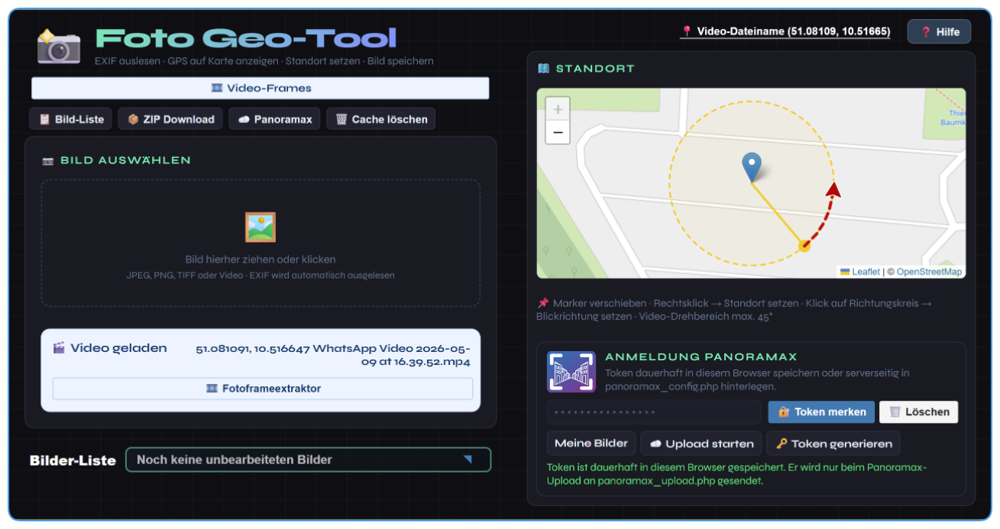
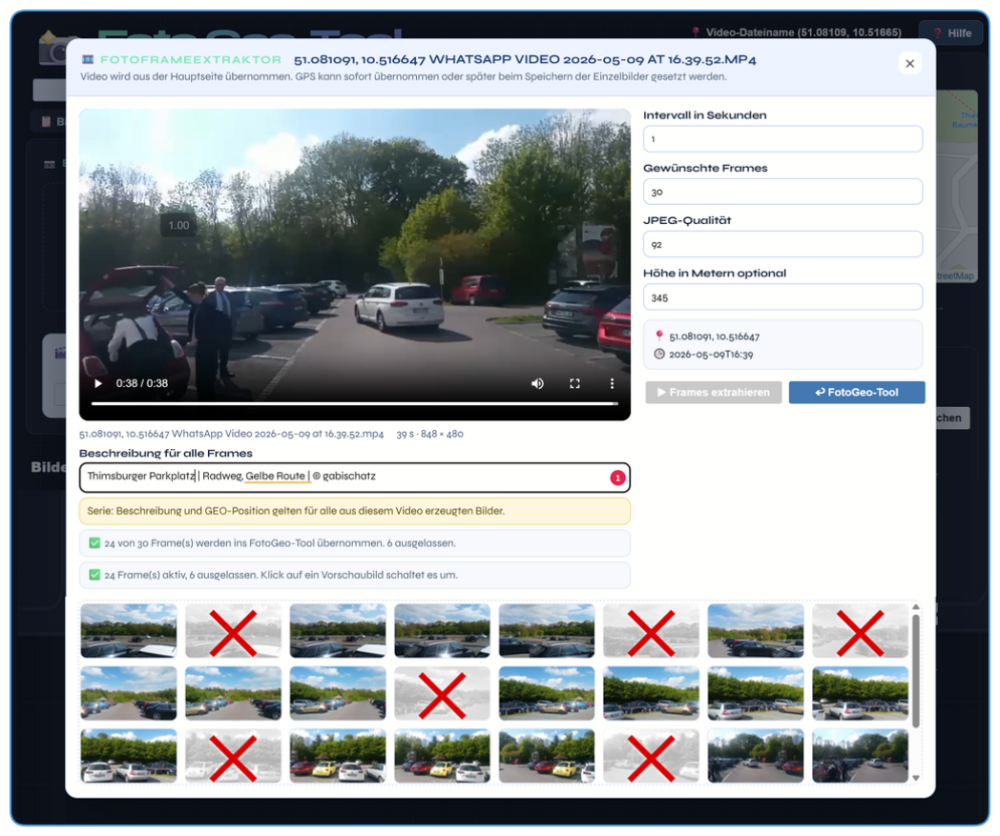
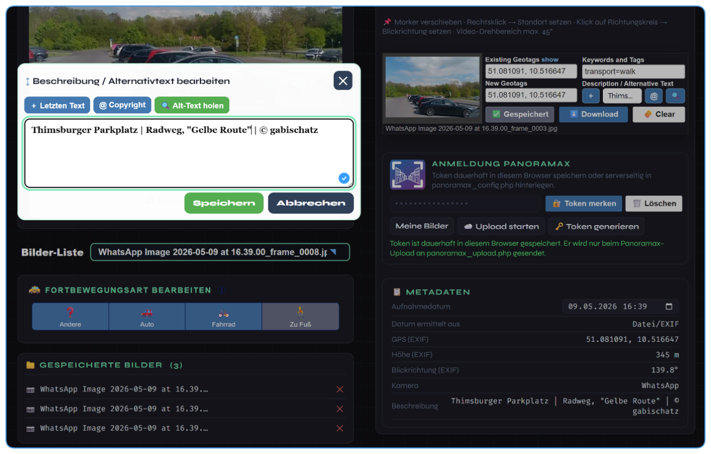

# Foto Geo-Tool

**Fotos und Videos wieder mit Geodaten nutzbar machen – für Panoramax und OpenStreetMap.**

Foto Geo-Tool ist ein kleines Browser/PHP-Werkzeug, das aus einem ganz praktischen Problem entstanden ist:

Man bekommt ein Foto oder ein Video per WhatsApp, Messenger, Mail oder aus einer anderen App – und die wichtigen Geodaten sind weg.  
Keine GPS-Koordinaten mehr, keine Blickrichtung, manchmal auch kein brauchbares Aufnahmedatum. Für normale Erinnerungsfotos ist das vielleicht egal. Für **Panoramax**, **OpenStreetMap** und Street-Level-Bilder ist es aber ein echtes Problem.

Dieses Tool soll helfen, solche Bilder wieder verwendbar zu machen.



## Die Idee

Viele Menschen haben Bilder oder kurze Videos von Wegen, Straßen, Plätzen, Sehenswürdigkeiten oder Landschaften.  
Gerade solche Aufnahmen können Mapperinnen und Mappern helfen:

- Schilder erkennen
- Wege prüfen
- Zufahrten kontrollieren
- Oberflächen und Barrieren sehen
- neue oder veränderte Situationen nachvollziehen
- Orte für andere besser sichtbar machen

Aber: Wenn die Bilder keine Geodaten mehr enthalten, kann Panoramax sie nicht sinnvoll einordnen.

**Foto Geo-Tool schließt diese Lücke.**

Man setzt nachträglich den Aufnahmeort auf der Karte, ergänzt Blickrichtung, Höhe, Zeit und Beschreibung – und bereitet daraus saubere JPEG-Dateien für Panoramax vor.

## Wofür ist das Tool gedacht?

Das Tool ist besonders nützlich für:

- WhatsApp-Fotos ohne EXIF/GPS
- WhatsApp-Videos, aus denen einzelne Bilder erzeugt werden sollen
- Handyvideos, die als Panoramabild-Serie genutzt werden sollen
- Bilder aus sozialen Netzwerken oder Messengern
- ältere Fotos, bei denen die Position noch bekannt ist
- Testaufnahmen für Panoramax
- einfache Street-Level-Bildserien für OpenStreetMap

Es geht nicht darum, Panoramax zu ersetzen.  
Das Tool soll nur dabei helfen, Bilder so vorzubereiten, dass Panoramax sie überhaupt sinnvoll verwenden kann.

## Hauptfunktionen

- Bilder per Drag-and-Drop oder Dateiauswahl laden
- Videos laden und daraus einzelne Frames erzeugen
- GPS-Position auf einer OpenStreetMap-Karte setzen
- Ortssuche über Postleitzahl und Ortsname
- Blickrichtung über einen Richtungskreis festlegen
- Drehrichtung bei Panoramavideos festlegen
- Höhe ergänzen
- Beschreibung / Alternativtext eintragen
- Serien aus Videoframes vorbereiten
- einzelne Videoframes auslassen
- Metadaten prüfen
- Bilder speichern und für Panoramax vorbereiten
- vorbereitete JPEG-Dateien per PHP/API zu Panoramax hochladen
- ZIP-Download der vorbereiteten Bilder

## Typischer Arbeitsablauf

### 1. Aufnahmeort und Blickrichtung festlegen

Zuerst wird der Aufnahmeort bestimmt.  
Das kann direkt im Foto Geo-Tool passieren oder über das zusätzliche Geo-Position-Tool.

Im Geo-Position-Tool setzt man die Position auf der Karte, legt die Start-Blickrichtung fest und wählt bei einem Panoramavideo die Drehrichtung.

Danach erzeugt das Geo-Position-Tool einen Link zum Foto Geo-Tool.  
Beim Öffnen dieses Links sind Koordinaten, Startwinkel und Drehrichtung schon voreingestellt.


So muss man im Foto Geo-Tool nur noch das Bild oder Video hineinziehen.

### 2. Video laden und Frames auswählen

Ein besonderer Anwendungsfall sind kurze Videos.

Beispiel:  
Man steht an einem Punkt, dreht sich langsam im Kreis und nimmt ein kurzes Video auf. Daraus kann das Foto Geo-Tool einzelne Bilder erzeugen. Diese Frames bekommen dann gemeinsame Geodaten, aber unterschiedliche Blickrichtungen.



Im Fotoframe-Extraktor kann man festlegen:

- wie viele Frames erzeugt werden sollen
- welche JPEG-Qualität verwendet wird
- welche Höhe eingetragen wird
- welche Beschreibung für die ganze Serie gilt
- welche Frames ausgelassen werden sollen

Ein Klick auf ein Vorschaubild schließt dieses Frame aus.  
Ausgeschlossene Frames werden ausgegraut und mit einem roten X markiert.

### 3. Bilder prüfen, speichern und vorbereiten

Nach der Übernahme ins Foto Geo-Tool werden die Bilder einzeln geprüft.



Dabei sieht man:

- Bildvorschau
- Karte
- gesetzte Koordinaten
- Blickrichtung
- Beschreibung
- gespeicherte Metadaten
- Upload-Bereitschaft

Wenn alles passt, wird das Bild gespeichert. Danach wird automatisch das nächste Bild geladen.

## Panoramax-Upload

Der Upload läuft nicht über die Panoramax-Webseite per Drag-and-Drop, sondern über eigenen PHP-Code.

Verwendete API-Aufrufe:

```text
POST /api/upload_sets
POST /api/upload_sets/<uuid>/files
POST /api/upload_sets/<uuid>/complete
GET  /api/upload_sets/<uuid>
GET  /api/upload_sets/<uuid>/files
```

Die wichtigste Datei dafür ist:

```text
panoramax_upload.php
```

Damit Panoramax die Bilder zuverlässig annimmt, werden sie vor dem Upload serverseitig als saubere JPEG-Dateien neu geschrieben.  
GPS und Aufnahmezeit werden zusätzlich über die Panoramax-API als Upload-Felder mitgegeben.

## Beispiel

Ein erfolgreich hochgeladenes Ergebnis ist hier zu sehen:

```text
https://panoramax.basi.re/?s=fp;s2;p5e3cd729-f26e-4b31-8a0a-9a6a91ff412b;c351.94/0.06/30;m17/51.081091/10.516647;udefault
```

## Warum nicht einfach direkt Panoramax verwenden?

Wenn ein Bild bereits saubere GPS-/EXIF-Daten enthält, kann man es natürlich direkt bei Panoramax hochladen.

Dieses Tool ist für die Fälle gedacht, in denen das nicht mehr stimmt:

- WhatsApp hat EXIF entfernt.
- Ein Video enthält keine Einzelbild-Geodaten.
- Die Blickrichtung fehlt.
- Die Bilder sollen vor dem Upload geprüft und beschrieben werden.
- Aus einem Video sollen mehrere Bilder mit passender Richtung erzeugt werden.

## Projektstruktur

```text
index.html                    Hauptseite
style.css                     Layout
script.js                     Browserlogik
upload.php                    lokaler Bildspeicher
delete.php                    Löschen gespeicherter Bilder
panoramax_upload.php          PHP-Upload zu Panoramax
panoramax_config.php.template Vorlage für Server-Konfiguration
zipcodes.json                 Ortsdaten für die Ortssuche
hilfe.html                    Hilfeseite
video-frame-extractor.html    separater Frame-Extractor / Altbestand
docs/                         Dokumentation
docs/screenshots/             Screenshots für README und Hilfe
```

## Lokaler Test

Für die reine Anzeige kann `index.html` direkt im Browser geöffnet werden.

Für Speichern und Panoramax-Upload ist ein Webserver mit PHP nötig.

Beispiel:

```bash
php -S localhost:8000
```

Dann öffnen:

```text
http://localhost:8000/index.html
```

## Serverbetrieb

Auf dem Server müssen die Dateien gemeinsam in einem Ordner liegen, zum Beispiel:

```text
/FotoGeoTool/
```

Die App verwendet relative Pfade und soll deshalb auch in einem anderen Ordner laufen.

Für den Panoramax-Upload muss auf dem Server eine echte Konfigurationsdatei vorhanden sein:

```text
panoramax_config.php
```

Diese Datei wird aus der Vorlage erstellt:

```text
panoramax_config.php.template
→ panoramax_config.php
```

Danach wird dort der Panoramax-Token eingetragen.

## Sicherheit

Bitte niemals persönliche Token, Passwörter oder private Konfigurationsdateien veröffentlichen.

Nicht ins öffentliche Repository hochladen:

- `panoramax_config.php` mit echtem Token
- Panoramax-Token
- Passwörter
- `.env`-Dateien
- private Uploadordner
- nicht öffentliche Originalbilder

Für GitHub gehört nur die Vorlage hinein:

```text
panoramax_config.php.template
```

## Geo-Position-Tool

Zum Setzen von Koordinaten und Start-Blickrichtung gibt es zusätzlich das Geo-Position-Tool:

```text
https://overpass-osm.de.cool/geo-position/index.html
```

Es erzeugt einen Link zum Foto Geo-Tool mit Parametern wie:

```text
https://overpass-osm.de.cool/FotoGeoTool/index.html?q=51.109790,10.636210,51,right
```

Damit öffnet sich Foto Geo-Tool bereits mit:

- Latitude / Longitude
- Start-Blickrichtung
- Drehrichtung

Danach muss nur noch das Video oder Bild geladen werden.

## Status

Das Projekt ist ein Arbeitsstand, aber der Panoramax-Upload funktioniert grundsätzlich.  
Rückmeldungen, Tests und Verbesserungsvorschläge sind willkommen.

## Lizenz

CC BY 4.0 — Lutz Müller (gabischatz)

Dieses Projekt dient der Vorbereitung von Bildmaterial für Panoramax und OpenStreetMap.
